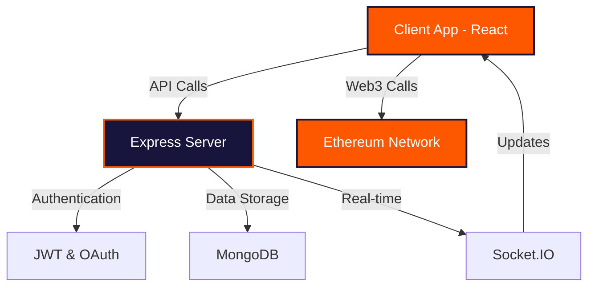

<div align="center">

# 🚀 CryptoCred


**A Modern Decentralized Finance Platform**

*Empowering users with secure, transparent, and accessible financial services on the blockchain*

</div>

---

## 🌟 Overview

CryptoCred is a cutting-edge decentralized finance (DeFi) platform that bridges traditional finance with blockchain technology. Built with modern web technologies and blockchain integration, it provides users with a seamless experience for managing digital assets and accessing decentralized financial services.

## ✨ Key Features

<table>
<tr>
<td width="50%">

### 🔐 **Security First**
- JWT-based authentication
- Google OAuth integration
- Encrypted data transmission
- Secure wallet connections

</td>
<td width="50%">

### 🌐 **Web3 Integration**
- Ethereum blockchain support
- Smart contract interactions
- Multi-wallet compatibility
- Real-time transaction tracking

</td>
</tr>
<tr>
<td width="50%">

### 💼 **User Experience**
- Intuitive Material-UI interface
- Responsive design with Tailwind CSS
- Real-time updates via Socket.IO
- Mobile-friendly architecture

</td>
<td width="50%">

### 🚀 **Performance**
- Fast Vite build system
- Optimized React components
- Efficient state management
- Lightning-fast API responses

</td>
</tr>
</table>

## 🏗️ Architecture



## 🛠️ Tech Stack

### Frontend (`cryptoClient`)
- **Framework:** React 18.3.1 with Vite
- **Styling:** Tailwind CSS + DaisyUI + Material-UI
- **Web3:** Ethers.js & Web3.js
- **State Management:** React Hooks
- **Authentication:** Google OAuth
- **Real-time:** Socket.IO Client

### Backend (`cryptoServer`)
- **Runtime:** Node.js with Express
- **Database:** MongoDB with Mongoose
- **Authentication:** JWT + bcrypt
- **Security:** CORS, Cookie Parser
- **APIs:** Google APIs integration
- **Real-time:** Socket.IO

## 🚀 Quick Start

### Prerequisites
- Node.js (v16 or higher)
- npm or yarn
- MongoDB instance
- Ethereum wallet (MetaMask recommended)

### Installation

1. **Clone the repository**
   ```bash
   git clone https://github.com/yourusername/cryptocred.git
   cd cryptocred
   ```

2. **Setup Backend**
   ```bash
   cd cryptoServer
   npm install
   cp .env.example .env  # Configure your environment variables
   npm run dev
   ```

3. **Setup Frontend**
   ```bash
   cd ../cryptoClient
   npm install
   npm run dev
   ```

4. **Access the application**
   - Frontend: `http://localhost:5173`
   - Backend API: `http://localhost:3000`

## 📁 Project Structure

```
CryptoCred/
├── cryptoClient/          # React frontend application
│   ├── src/              # Source code
│   ├── public/           # Static assets
│   └── package.json      # Frontend dependencies
├── cryptoServer/         # Node.js backend application
│   ├── controllers/      # API controllers
│   ├── db/              # Database configuration
│   ├── router/          # API routes
│   ├── utils/           # Utility functions
│   └── package.json     # Backend dependencies
└── README.md            # This file
```

## 🔧 Configuration

### Environment Variables

Create a `.env` file in the `cryptoServer` directory:

```env
# Database
MONGODB_URI=your_mongodb_connection_string

# JWT
JWT_SECRET=your_jwt_secret_key

# Google OAuth
GOOGLE_CLIENT_ID=your_google_client_id
GOOGLE_CLIENT_SECRET=your_google_client_secret

# Server
PORT=3000
NODE_ENV=development
```

## 🤝 Contributing

We welcome contributions! Please follow these steps:

1. Fork the repository
2. Create a feature branch (`git checkout -b feature/amazing-feature`)
3. Commit your changes (`git commit -m 'Add amazing feature'`)
4. Push to the branch (`git push origin feature/amazing-feature`)
5. Open a Pull Request

## 📄 License

This project is licensed under the MIT License - see the [LICENSE](cryptoServer/LICENSE) file for details.

## 🙏 Acknowledgments

- Built with ❤️ by CryptoCred Team
[Utkarsh Uttam](https://github.com/UtkarshUttam),[Abhishek M](https://github.com/yourusername), [Amritanshu Shukla](), [Tanya Barsainya](), [Shashwat Wazalwar]()
- Powered by the Ethereum ecosystem
- UI components from Material-UI and DaisyUI

---

<div align="center">

**Made with** <span style="color: #fd5800;">❤️</span> **for the DeFi community**


</div>
